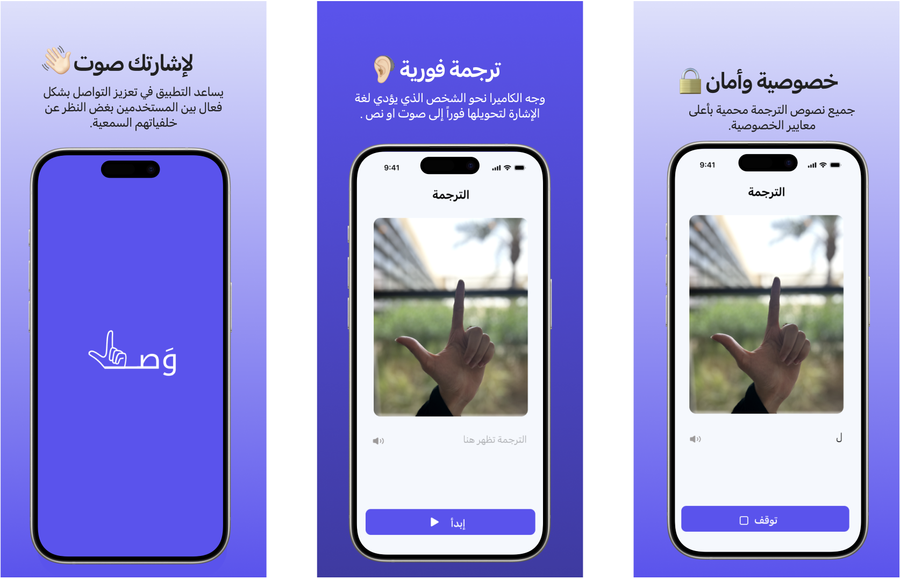

# Wasl - Seamless Sign Language Translation

***(Your Sign has a Voice) 🔉 لإشارتك صوت***

---

### 📖 Table of Contents
1. [Problem Statement](#problem-statement)
2. [App Overview](#app-overview)
3. [App Statement](#app-statement)
4. [Goals](#goals)
5. [Technologies Used](#technologies-used)
6. [Features](#features)
7. [App Status](#app-status)
8. [How Wasel Works](#how-wasel-works)
9. [Developers](#developers)
10. [Contact Information](#contact-information)

---

### ❓ Problem Statement
Communication between deaf and hearing individuals can be difficult, creating challenges in daily interactions, education, and emergencies. Current solutions are often complicated or hard to access, showing a need for an easier, more effective way to connect.

---

### 🌐 App Overview
**Wasl** is a mobile application developed to bridge the communication gap between the deaf and hearing communities. Using advanced AI tools and 2D videos, translates sign language into text and vice versa, facilitating smooth and inclusive communication. By focusing on the needs of deaf and hard-of-hearing (DHH) individuals, Wasel promotes understanding and connection, empowering users across various contexts.

---

### 📱 App Statement
**Wasl** aims to help DHH individuals in Saudi Arabia communicate easily by providing a tool that translates sign language to text or voice with high privacy standards.

---

### 🎯 Goals
- **Facilitate Real-Time Communication:** Provide a smooth, instant way for deaf and hearing individuals to communicate across all areas of life.
- **Enhance Accessibility:** Ensure accessibility with VoiceOver support and adaptable text resizing. 
---

### 🛠️ Technologies Used
The following technologies power Wasl:

  
  
  
  
  
  
  
  

---

### 🚀 Features
- **Real-Time Sign Language Recognition:** Converts camera-captured signs into text-to-speech.
- **Text-to-Sign Conversion:** Enables hearing individuals to communicate translate text to sign.
- **Privacy-Focused Design:**  Ensures high privacy for all user communications and ensure the simplcity.

---

### 📈 App Status
- **Current Version:** 1.0.0 (Beta Release on the App Store)
- **Current Development Status:** The Wasl app is partially completed and available on the **App Store** in its beta form, with foundational features implemented. Active development is ongoing to expand its capabilities.
- **Key Features Available:**
  - Real time sign language translation (only Arabic alphabet in mean time).
  - Text-to-Sign.
  - User-Friendly interface for accessibility
- **Upcoming Enhancements:**
  - Improved AI model accuracy for better translation
  - Additional features for emergency communication
  - Enhanced 3D animation for more expressive sign language translations

---

### 📷 How Wasel Works
 <!-- Ensure the image file is in the repo or provide the correct path -->

---

### 👥 Developers
- **Latoof** - Digital Project Manager: [GitHub Profile](https://github.com/LATIFARYES)
- **Aisha** - Tech (Front-End): [GitHub Profile](https://github.com/ash9995)
- **Zainab** - Tech (Back-End):  [GitHub Profile](https://github.com/Dev-Zinab)
- **Alhlam** - UX/UI Designer: [GitHub Profile](https://github.com/Ahlam10)
- **Maryam** - UX/UI Designer: [GitHub Profile](https://github.com/Maryam-Alsaggaf)

---

### 📞 Contact Information
For more information, visit our [linktr.ee page](https://linktr.ee/waselapp) for additional resources and updates.
